# 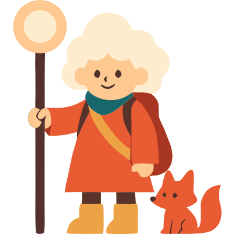 夢の旅人 (Dream Traveler)

## 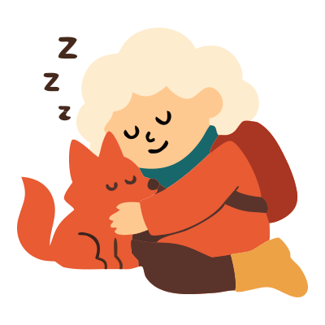 專案介紹

此專案為 **2025 AAPD x 六角學院 設計前端產品研發營** 之前端切版作品。

將睡眠變成遊戲，陪伴上班族戒掉睡前滑手機的遊戲式睡眠自律 APP。

## 🎨 設計師 (AAPD)

- [Heather Chiu](https://www.linkedin.com/in/heather-chiu-9190a81a5/)
- [Evelyn Lin](https://www.evelyn010.website/)
- [Tzuting Tu](https://www.behance.net/7ec46fba)
- [Henry](https://www.behance.net/henrywu15)

## 💻 前端人員 (六角學院)

- 首頁、選擇路徑頁 - [yuan6636](https://github.com/yuan6636)
- 睡眠旅行頁、設定頁 - [papa2415](https://github.com/papa2415)
- 圖鑑、收藏頁 - [CKS40660](https://github.com/CKS40660)
- 日誌功能頁 - [YPINPIN](https://github.com/YPINPIN)

## 🚀 畫面介紹

###  首頁 → 選擇路徑頁 → 睡眠旅行頁

> 每一次入睡，都是一場夢的旅程。

  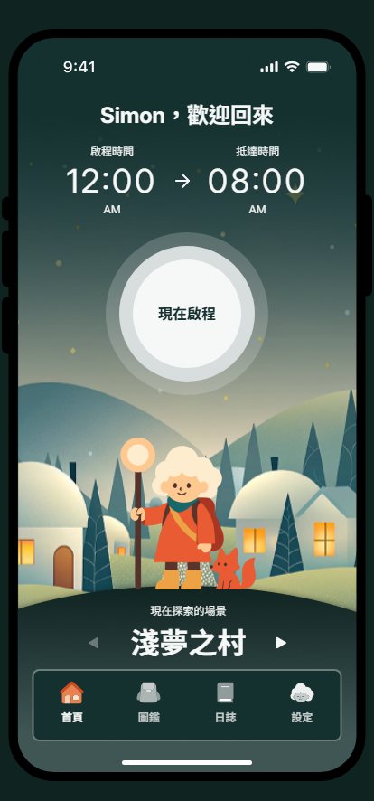
  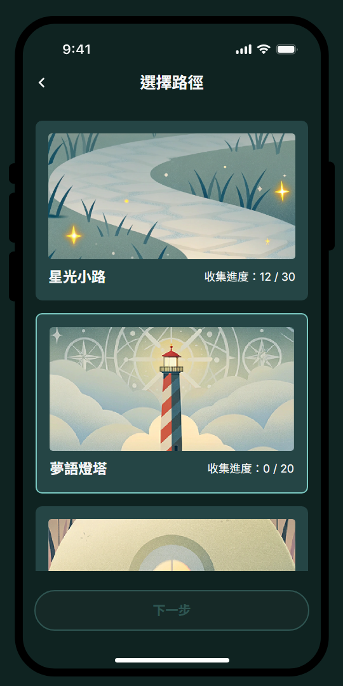
  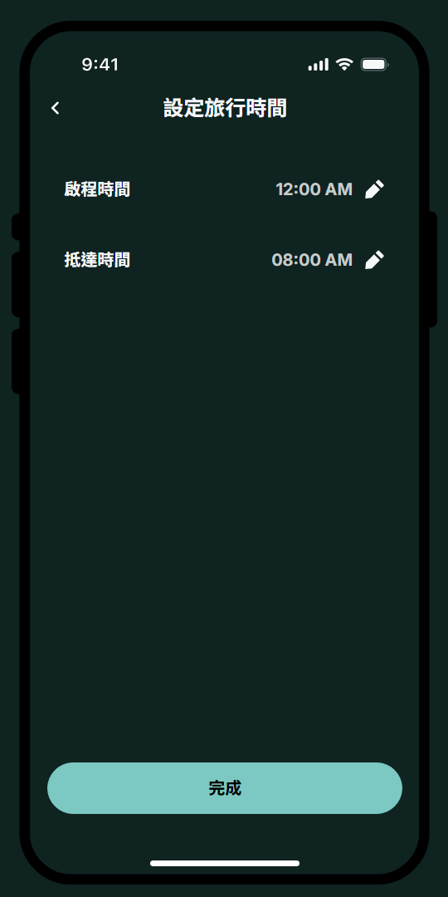

 

  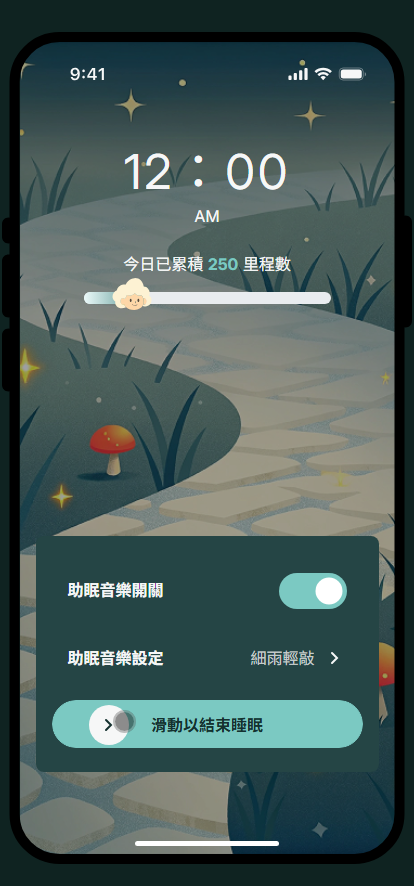
  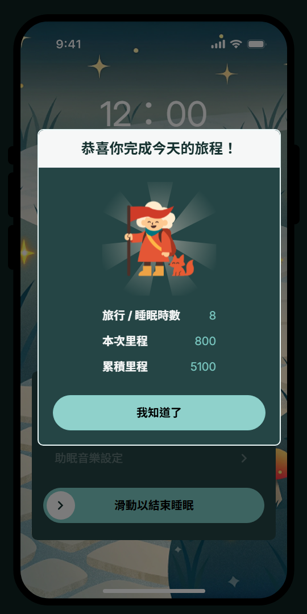
  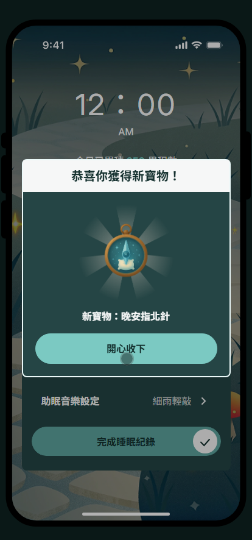
  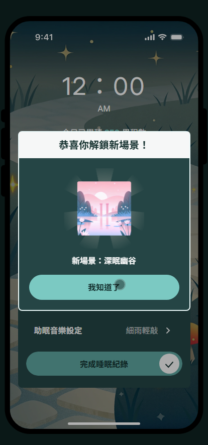

###  圖鑑 → 收藏頁

> 收集夢中寶物，豐富你的旅程。

  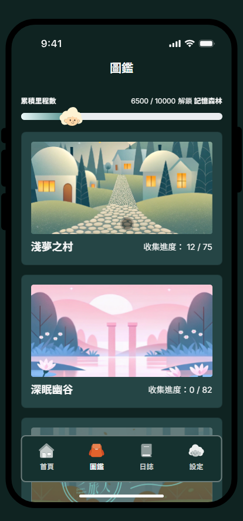
  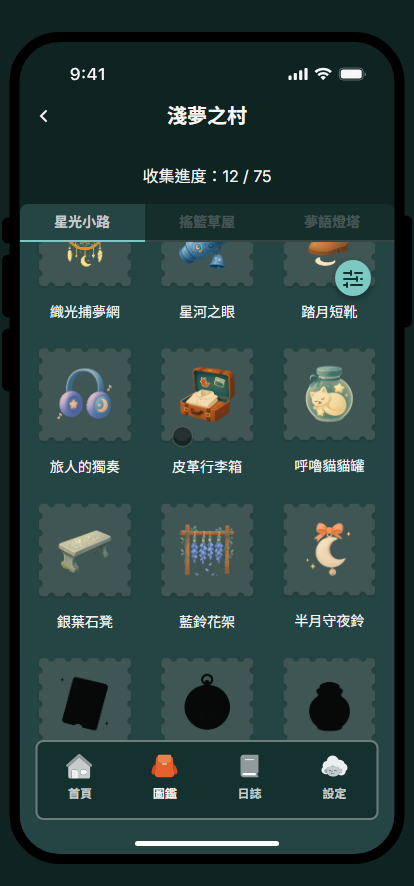
  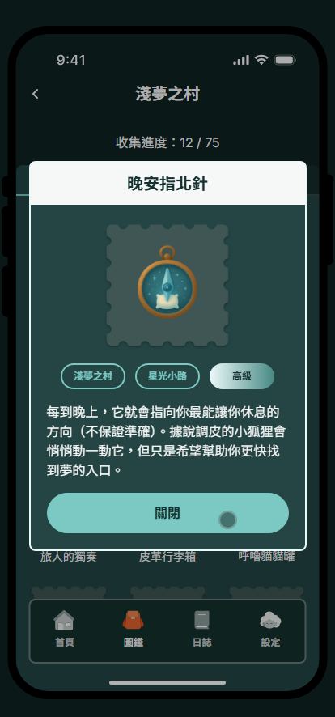

###  日誌功能頁

> 追蹤睡眠日誌，養成穩定作息。

  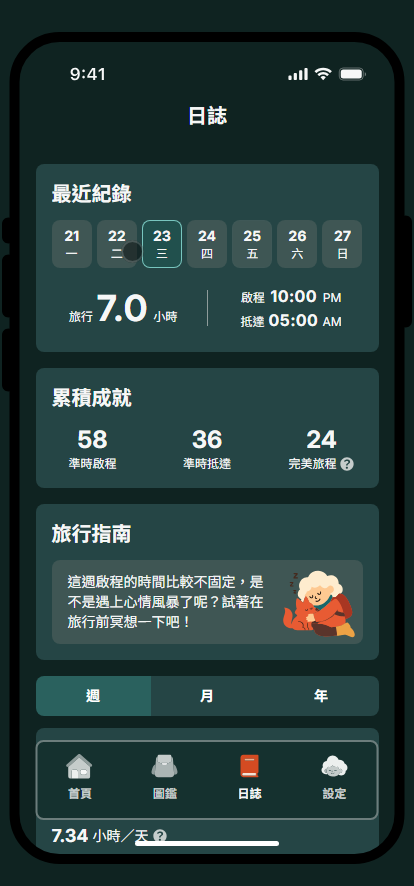
  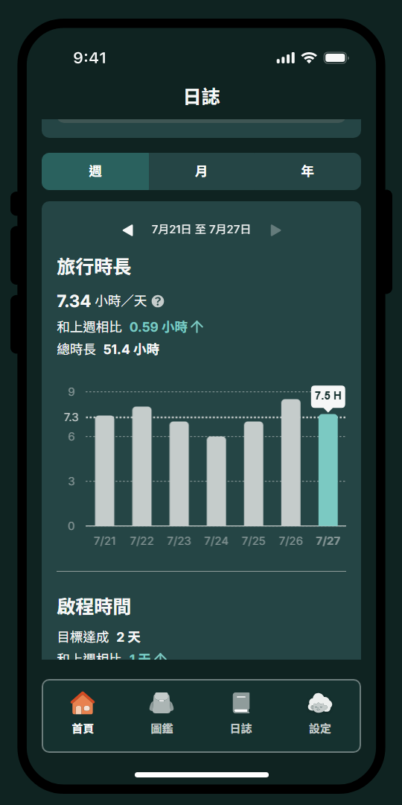
  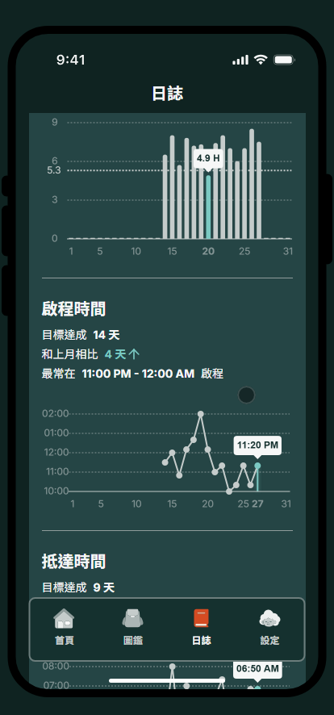
  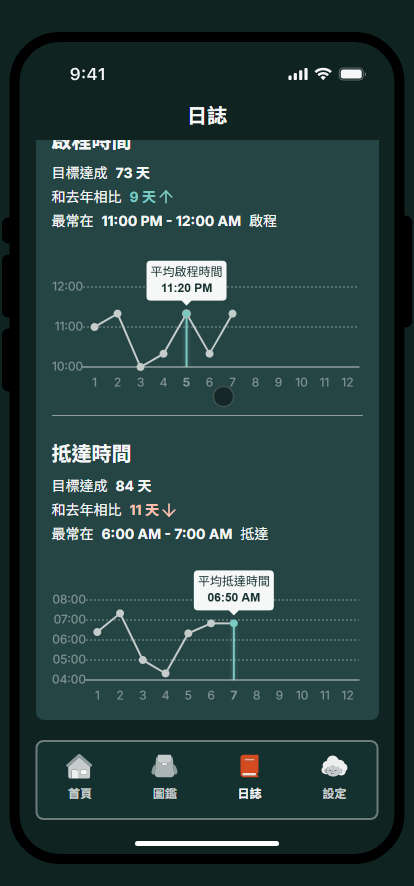

###  設定頁

> 帳號設定與開啟提醒。

  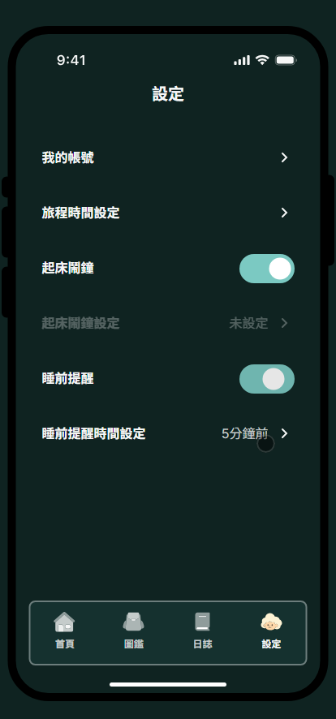
  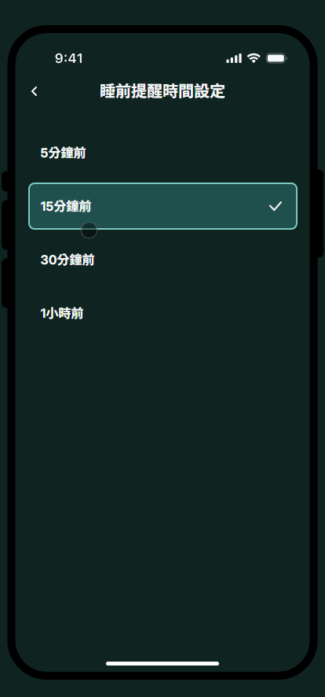

